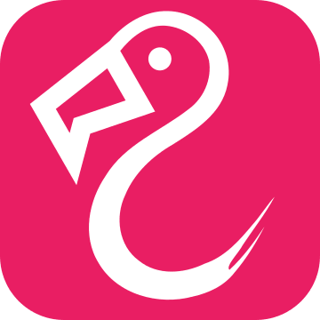

# ionChannel
## Radically-Inclusive Jean Technology

ionChannel, or ionch for short, is (or at least, will be) an open-source lightweight federated
microblogging server written in Java 11. By default it's configured for a single user or a few users
to run a private instance out-of-the-box, but due to its modular nature it can support a wide range
of backends, federation models, and instance-specific features and quirks.

The built-in ActivityPub plugin lets ionch talk to Mastodon, Pleroma, and many other existing
servers on the fediverse. So you can think of ionch as an AP or Mastodon-compatible server.

## Name
ionChannel is named after [ion channels](https://en.wikipedia.org/wiki/Ion_channel), essential and
diverse parts of every living creature. ionch is simply a contraction of it. The i is lowercase to
avoid confusion with a lowercase L in many sans-serif fonts, and also it just looks cooler.

ionChannel should always be written as camelCase, like in this README. ionch should always be
written as all lowercase, even at the beginning of a sentence. If you absolutely must, "Ion Channel"
is also an acceptable form of the name.

ionch is pronounced like "ion" (EYE-on) followed by the "-ch" in "crunch".

## Logo
It's a flamingo[!](https://youtube.com/watch?v=rY-FJvRqK0E) A very stylized one, but a flamingo
nonetheless. The beak, when rotated to be horizontal, additionally resembles a rectangular speech
bubble. There's a specially deformed version for display at 16x16 on standard density
displays:  (compare with the standard version at this resolution:
)

## Project Status
ionChannel is a very early work-in-progress at this point. Progress is slow, but it is there.

## Why Java
Java is an extremely mature and fast platform with an innumerable amount of person-hours poured into
it. The OpenJ9 JVM we recommend has a long heritage beginning at IBM, and has been very thoroughly
proven in server use cases, and is more than efficient enough to run on small boxes too.

As well, Java is a well-known language with a lot of good tooling available for it, and it is very
easy to get one's feet wet with the language. As a high-level language, it also lacks the problems
often run into with "low-level" languages like C such as buffer overflows and related memory
corruption issues, which are *disastrous* with networked use cases.

We also choose to ban reflection and similar dynamic programming tricks, to make the codebase highly
explorable with basic tools and basic knowledge of the language. Some other languages have dynamic
programming paradigms at their core while additionally having poor or expensive tooling, making
exploring such a project as an outsider an ordeal.

At no point do instance admins have to think about the fact ionChannel is written in Java; we bundle
our releases as native executables and include a stripped-down version of OpenJ9. Only developers
have to be aware of and use Java development tools.

## Goals

### Efficiency
ionch should be as efficient as possible and run easily on a Raspberry Pi 2 or slower. The usage of
Java and a modular plugin-based design facilitates this.

### Ease of Use
It should be easy to get started with ionch, with as much as possible having sensible defaults and
wizards being provided where defaults cannot be assumed.

### Extensibility
As much of ionch as possible should be able to be extended, replaced, or removed. One size does not
fit all, and monolithic servers, especially in the fediverse landscape, are simply a dead end.
Instance admins should not have to maintain entire forks of the software just to add a couple
tweaks.

## Social Pillars

### Safety and Respect
There are ways to structure social media which are inherently unsafe or disrespectful:
automated systems which are vulnerable to astroturfing and abuse-report abuse, pinning
personally-identifying information on users or forcing them to use their legal names, etc.

Any suggestion or PR that puts users at risk or denies someone their dignity or identity will be
rejected.

### Inclusion and Approachability
Without diverse voices like Lovelace and Turing, we would not have computers as we know them.
Without people like Mary Jackson or Margaret Hamilton we wouldn't have made it to the moon.
Social media might not be as groundbreaking as all that, but it has hard problems that no one
person, nor any one kind of person, can solve. We'll need a bigger boat.

At every step, from ionch governance, to code, to distribution, to instance administration, to
post moderation, to bug reporting and feature requests, we want to lower the bar to entry and
give everyone's voice a chance to be heard.

### Openness
Not all open-source software is developed in the open. Some software just gets source pushes
for point releases, accepts no PRs, and gives very little insight into how it was developed or
the reasons behind its design choices.

The public repository for ionch is where it is developed. We welcome PRs, talk a lot about the
development process right in the fediverse where it matters, and thrive on user and developer
feedback.
